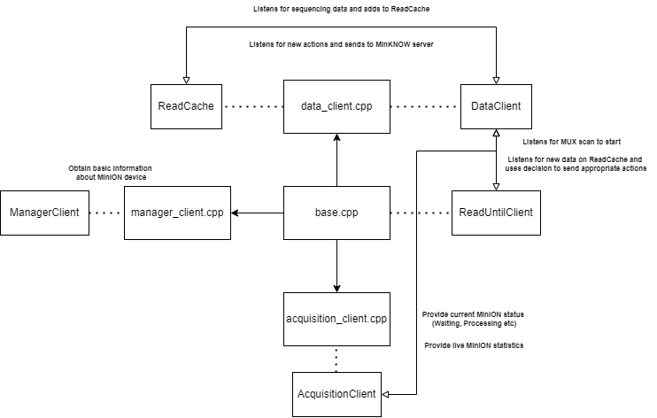

# Optimised-Read-Until-API

This is an attempt to recreate [Read Until API](https://github.com/nanoporetech/read_until_api) which is originally written in Python, now written in C++. Proto files are sourced from [Oxford Nanopore Technologies](https://github.com/nanoporetech/minknow_api/tree/master/proto/minknow_api). MinKNOW API relies on [GRPC](https://grpc.io/), where the MinKNOW software contains the server and Read Until enacts as the client. Researchers can utilise Read Until with a decision maker to filter strands during genome sequencing. The aim of this project is to optimise performance and make live decision making more viable.

Installation
------------

### Download GRPC Locally (required)
[GRPC Installation](https://grpc.io/docs/languages/cpp/quickstart/)

Follow until "Build the example".

Make sure you have not skipped any steps as this will cause strange file missing errors down the track.

### Build this Project

```
# Clone this project however you wish

git clone git@github.com:brianzhang2101/Optimised-Read-Until-API.git

# Move the minknow_api folder into the examples/cpp folder in your locally installed GRPC files

mv Optimised-Read-Until-API/minknow_api/ ~/grpc/examples/cpp/

# Move the proto files into the examples folder in your locally installed GRPC files

mv Optimised-Read-Until-API/proto/ ~/grpc/examples/
```

You may optionally remove any of the other example/proto files included in the local GRPC files as we are only interested in the above two folders.

How to Run
------------
Make sure the MinION device is plugged in and you have initiated a scan prior to running the executable below.

```
# Files are generated into this directory

cd grpc/examples/cpp/minknow_api/cmake/build

# Run CMake (2 parent directories away)
cmake ../..

# Autogenerate the proto files and build Read Until
make

# Run the executable (can run anytime, since it will wait until MUX Scan)
./read_until
```
Assuming all steps were taken correctly, you should see a message displaying the ID of the first cell position (this can be edited via code to connect other cells and make sure to redo the above steps to recompile). This should be followed by information printed every second about the scanned data.

### Seperating Messages

Statistics printed every second and other important messages are printed to ```cout```, whereas debugging messages are sent to ```cerr```. You can append output into seperate files for example:

```
./read_until > cout.txt 2> cerr.txt
```

How it Works
------------


The file structure of this project differs to that of the original Read Until. Logic is spread out over various files and is utilised via ```base.cpp``` to avoid excessive method forwarding.

Each file contains documentation detailing the purposes of every function and how they intertwine.

### Addresses
```localhost:9501``` represents the insecure address for the manager server

```localhost:8000``` represents the insecure address for all other servers
